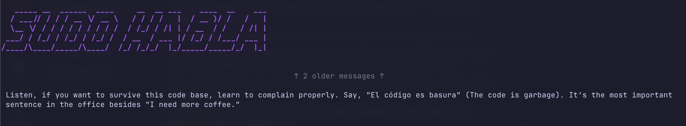

# sudo-habla 🐬☕


> A hostile, terminal-based Spanish tutor for cynical developers.


Most language learning apps give you a dancing green owl that claps when you successfully say "the apple is red." They don't teach you how to survive a daily standup, complain about legacy spaghetti code, or explain a merge conflict to your lead engineer. 

**sudo-habla** is an open-source CLI dashboard that lives in your terminal. It reads your local files, reviews your uncommitted git diffs, and forces you to learn actual, technical Spanish by ruthlessly mocking your code. 

No gamification. No positive reinforcement. Just terminal-native immersion.

## Core Philosophy

* **Context Over Conjugation:** You don't need to know how to order a meal; you need to know how to say "the deployment failed."
* **Hostile Learning Environment:** Positive reinforcement is for juniors. You learn faster when your ego is on the line.
* **Terminal Native:** If you have to leave your IDE and open a browser to learn, you won't do it. 
* **Retention by Force:** The CLI secretly parses AI responses, logs the technical vocabulary you struggle with to a local JSON database, and weaponizes it against you later.

## Tech Stack

* **Runtime & Package Manager:** [Bun](https://bun.sh/) (ast file I/O for local DB and file reading)
* **UI Framework:** [Ink](https://github.com/vadimdemedes/ink) (React for the terminal, Flexbox layouts)
* **AI Engine:** [Vercel AI SDK](https://sdk.vercel.ai/) (Stream handling and provider routing)
* **LLM Providers:** Google Gemini / OpenAI (Configurable)

## Key Features

### 1. The Code Reviewer (`/roast` & `/revisar <file>`)
Stop using blind generic prompts. `sudo-habla` hooks into your local environment. Run `/roast` to have the AI tear apart your current uncommitted `git diff`, or run `/revisar src/App.tsx` to have it read a specific file. It critiques your architecture in perfect Spanish and provides English translations for the most devastating insults.

### 2. The Scrum Master (`/daily <update>`)
Type your daily standup update in English (e.g., `/daily I fixed the CSS bug`). The AI acts as a hostile Scrum Master. It translates your update, brutally mocks your low velocity, and gives you a *Mejor dicho* (Better phrasing) section showing how a real senior developer would have delivered it.

### 3. The Boss Fight (`/entrevista`)
A terminal-based technical interview. The AI asks you a complex software engineering question entirely in Spanish (e.g., *"¿Cuál es la diferencia entre promesas y observables?"*). You type your answer. It grades your technical accuracy and your Spanish grammar simultaneously. 

### 4. The Zen Mode Dashboard (Active Recall)
A React-powered split-pane terminal UI. As you interact, the app secretly updates a persistent `~/.sudo-habla-vocab.json` file. 
* Hit `Ctrl + B` to toggle the "Cheat Sheet" sidebar that tracks your mastery of specific words using a traffic-light color system. 
* Type `/quiz` to trigger a multiple-choice pop quiz based entirely on the vocabulary you've failed in the past.

## Getting Started

You can install `sudo-habla` globally via NPM, or run it directly using Bun.

**Option 1: Global Install**
```bash
npm install -g sudo-habla
# or
bun add -g sudo-habla

sudo-habla
```

**Option 2: Local Development**
```bash
git clone https://github.com/PURPLE-ORCA/sudo-habla.git
cd sudo-habla
bun install
bun dev
```

*Note: On first run, use the `/config` command to set up your preferred AI provider (Gemini recommended) and paste your API key.*

## Contributing

This CLI is built for speed and developer experience. If you want to contribute, adhere to the following rules:
1. **Never break the terminal layout.** If your feature causes Ink's Flexbox to wrap awkwardly or ghost the terminal height, it gets rejected.
2. **Tab Autocomplete > Menus.** Do not add clunky vertical `SelectInput` menus. If a command needs arguments, add it to the bash-style Tab registry.
3. **Keep the persona intact.** If you write a new system prompt, it must be cynical, technical, and accurate.

## License

MIT License. Do whatever you want with it, just don't blame me when you accidentally insult your tech lead in perfect Spanish.